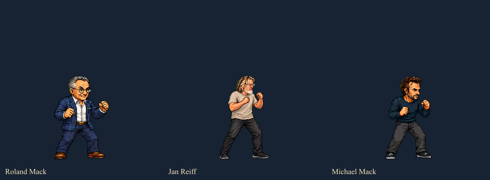

# Zeichenstil-Abgleich · 2026-09-09

Stand der Bilder: Alpha 0.2.7. 40 spielbare Figuren und ein Endgegner.

## Ergebnis

Jan passt technisch ins gemeinsame Raster, künstlerisch aber noch nicht vollständig zu Roland. Das ist schon im unvergrößerten Standbild sichtbar. Die bisherige Vereinheitlichung der Ausgabeauflösung war keine Vereinheitlichung aller Zeichnungen.

Die drei Ausschnitte sind weder gestreckt noch individuell vergrößert. Die Figuren nutzen 256er Zellen und ungefähr 196 Pixel Standhöhe. Das Bild bei 100 % ansehen.

Jan hat längere, realistischere Proportionen und feinere Schattierungen als Rolands kompakte Arcade-Karikatur. Auch Valentina und Teile des Social-Media-Teams weichen davon ab. Bei den Maskottchen unterscheiden sich vor allem die Schattenflächen und die Detailmenge. Roland sollte die verbindliche Zeichenreferenz für die menschlichen Kampfsprites sein. Dieser Audit ersetzt noch keine Zeichnungen.

Vollständige Entwickleranalyse und besondere Charaktermechaniken (Spoiler)

## Sichtbefunde

| Gruppe | Befund | Konsequenz |
|---|---|---|
| Roland und die übrigen Mack-Figuren | Weitgehend zusammengehörige Arcade-Karikaturen mit betonten Köpfen, Händen, Gesichtszügen und klarer Lichtkante. Michael etwas weniger überzeichnet; verschiedene Haar- und Stofftexturen. | Roland als verbindliche Referenz für menschliche Kampfsprites verwenden, Michael als zweite Kontrolle. |
| Max, Matthias, Laurent, Reinhold, Nathalie Ruder, Andreas | Ähnliche kompakte Proportionen, deutliche Konturen und vereinfachte Gesichter. | Grundstil beibehalten; Unterschiede zwischen Stand und Lauf bei späteren Überarbeitungen beachten. |
| Michael Scholz, Karsten, DJ BoBo, Stefan Mross, Otto, Ross | Überwiegend nahe am Arcade-Look; teilweise rundere, flächigere Schattierung. | Geringere Priorität als Jan. Keine pauschale Neuzeichnung erforderlich. |
| Michael Vendel | Etwas naturalistischer und kleiner wirkende Gesichtsmerkmale, aber noch relativ kompakter Körper. | Zusammen mit neueren Figuren nachkontrollieren. |
| Jan normal | Länger wirkende Proportionen, weniger karikierte Gesichtszüge, feinere Stofffalten und Haarlinien; flächigere dunkle Hose. Schon ohne Verwandlung sichtbar anders als Roland. | Höchste Priorität: Körper und Kopf nach Rolands Arcade-Proportionen neu zeichnen; Identität, Brille, Haare, Bart und Kleidung erhalten. |
| Jan grün | Weichere Muskelmodellierung, große flächige Shirt-/Hosenpartien; wirkt eher wie verkleinerte Illustration. Spezial-/Reaktionsclips nutzen weiterhin Standposen. | Eigenständige Zeichnungen mit klareren Schattenflächen und passenden Aktionsposen erforderlich. Die neue Effektanimation ersetzt keine Körperanimation. Größe und Spielregeln beibehalten. |
| Valentina | Klareres Pixelbild als vor Alpha 0.2.6, jedoch weiterhin naturalistischere Figur und anders gezeichnete Gesicht-/Kleidflächen als die älteren Arcade-Karikaturen. | Technische Detailverbesserung nicht mit abgeschlossener Stilangleichung verwechseln. |
| Nathalie Schär, Glen, Steffen | Realistischere Gesichter und großflächigere Kleidung; vor allem Glen und Nathalie im Portrait erkennbar andere Ausarbeitung. | Nach Jan an denselben Zeichenvorgaben ausrichten. |
| Ed, Edda, Snorri, Madame Freudenreich, Wakala, Olli, Böckli, Louis, Graumacher | Unterschiedliche Körperformen sind richtig. Allerdings reicht die Oberflächenzeichnung von flächig/comichaft (besonders Olli, Louis) bis dicht texturiert (Snorri, Wakala). | Eigene Maskottchen-Proportionen erhalten, aber Konturen und Schattenstufen angleichen. Keine menschlichen Körperverhältnisse erzwingen. |
| Robbemond, Tesla | Robbemond realistischer modelliert; Tesla näher an der kompakten menschlichen Arcade-Gruppe. | Robbemond bei der zweiten Überarbeitungsrunde berücksichtigen. |

Portraits wurden separat verglichen. Blickrichtung, Hintergrund und goldene Lichtkante verbinden den Großteil der Auswahl; das allein macht die unterschiedlich gezeichneten Gesichter nicht einheitlich. Jan und Valentina haben vorvergrößerte Portrait-Quelldateien. Die anderen Quellen sind meist dichter aufgelöst. Die Messung identischer 4×4-Blöcke beschreibt diese Dateistruktur, nicht die tatsächliche Qualität oder Gleichheit im Menü.

## Verbindliche Vorgaben für eine Überarbeitung

- Referenzen für menschliche Kampfsprites: Rolands Stand, Lauf und Tritt in tatsächlicher Spielgröße; Michael als zusätzliche Kontrolle. Ein hochauflösendes Portrait genügt dafür nicht.
- Kompakte Arcade-Proportionen, gut erkennbare Köpfe und Hände; das Kopf-/Körperverhältnis der Referenz in allen Clips beibehalten.
- Klare dunkle Konturen, zusammenhängende Schattenflächen und sparsame Lichtkanten. Keine malerischen Mikroverläufe, kein pauschales Weichzeichnen oder 2×2-Blockfilter.
- Alle Posen einer Figur gemeinsam bearbeiten. Ein ausgetauschtes Standbild allein erzeugt beim nächsten Angriff wieder einen Stilwechsel.
- Weiterhin native 256er Zellen; grüne Form native 384er Zellen. Körpergröße, Bodenkontakt und feste Ursprünge dürfen beim Export nicht springen.
- Abnahme nebeneinander in Stand, Lauf, Faust, Tritt, Luftangriff und Reaktion, anschließend im Kampf gegen Roland und Snorri.

## Prüfumfang und Grenzen

- Alle 697 normalen Spielclips auf vorhandene Bilddateien geprüft; 2.501 belegte Posen gefunden (einschließlich Wiederverwendungen zwischen Clips, keine Behauptung von 2.501 eigenständigen Zeichnungen).
- Für alle 41 Figuren Stand, zwei Laufphasen und Tritt visuell auf Vergleichstafeln angesehen; alle 41 Portraits zusätzlich betrachtet. Jans grüne Form separat im Stand verglichen.
- Raster-Messungen erfassen exakt gleiche Farbblöcke, keine Anatomie oder künstlerische Stileinheit. Sie ersetzen die Sichtprüfung nicht.
- Kein vollständiges Abspielen jeder Animation in jedem Matchup in diesem Audit. Keine Charaktergrafiken als Teil dieses Abgleichs ersetzt. Die noch erforderlichen Neuzeichnungen sind oben benannt.

Reproduzieren: `node --experimental-strip-types scripts/audit-animation-assets.mjs`, `node --experimental-strip-types scripts/audit-pixel-grid.mjs` und `node --experimental-strip-types scripts/compare-character-style.mjs`. Vergleichstafeln und Messwerte werden unter `../work/` geschrieben.

